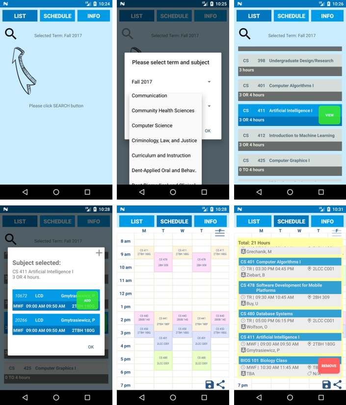

# U TIME (UICTime)

U TIME is a time scheduling application for University of Illinois at Chicago undergraduate and graduate students. Users can check class information in advance of registration day and create colorful time table to manage the schedule. 

## Available on Google Play Store

- You can download it from [Here][store]

## Dependencies

If you use Android Studio as recommended, the following dependencies will **automatically** be installed by Gradle.

- Android SDK v7 appcompat library
- Android SDK v7 recyclerview library

## Getting Started

- Clone this repo:

```sh
git clone https://github.com/junlee91/uictime.git
```

- Open the project in [Android Studio][studio].
- Compile and deploy to your Android device or Android Virtual Device (such as a Nexus 5).

## Screenshots

[](https://github.com/junlee91/uictime/blob/master/screenshot/uictime_screenshots.png)

[store]: https://play.google.com/store/apps/details?id=com.sodastudio.uictime&hl=en
[studio]: https://developer.android.com/tools/studio/index.html